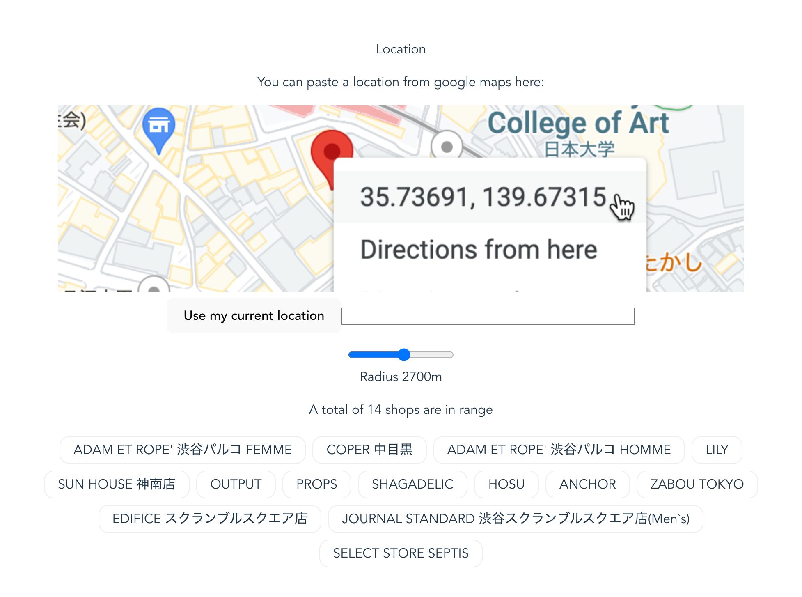

# Microfulfilment PoC

This is a tiny vue application that takes our currently active shops and compares their distance with a given address.

See the live version at [https://ddikman.github.io/shop-distance-poc/](https://ddikman.github.io/shop-distance-poc/)

## running

It's a vite project so run it with `npm run dev`

## deployment

The `dist` folder is committed so any time changes are made, run `npm run build` and commit that and it'll be accessible on github pages.